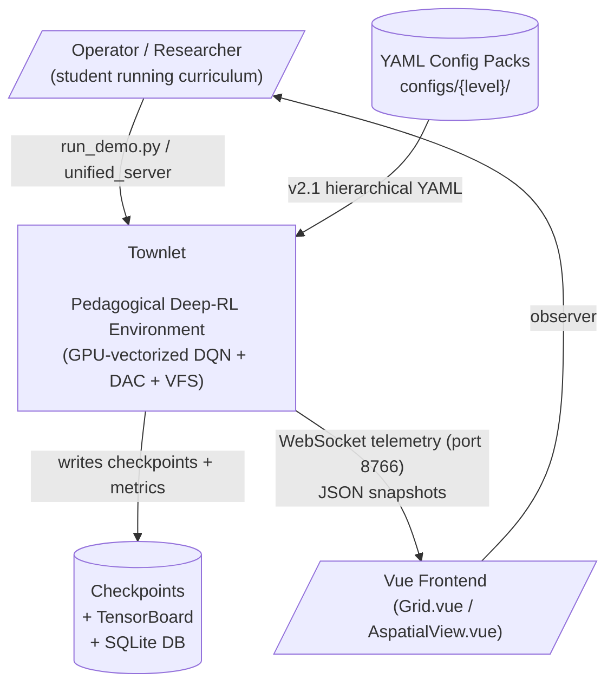
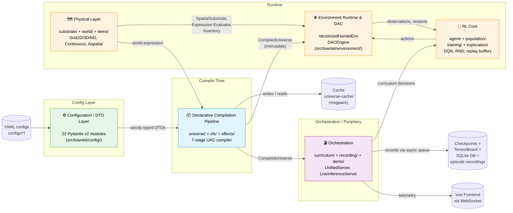
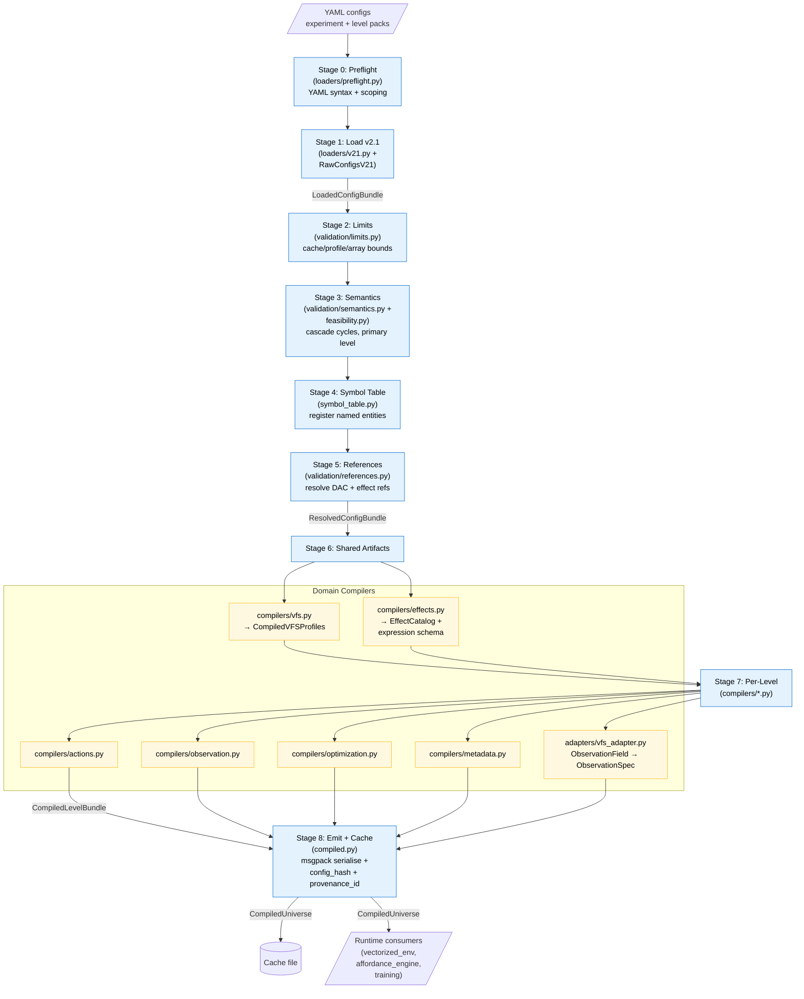
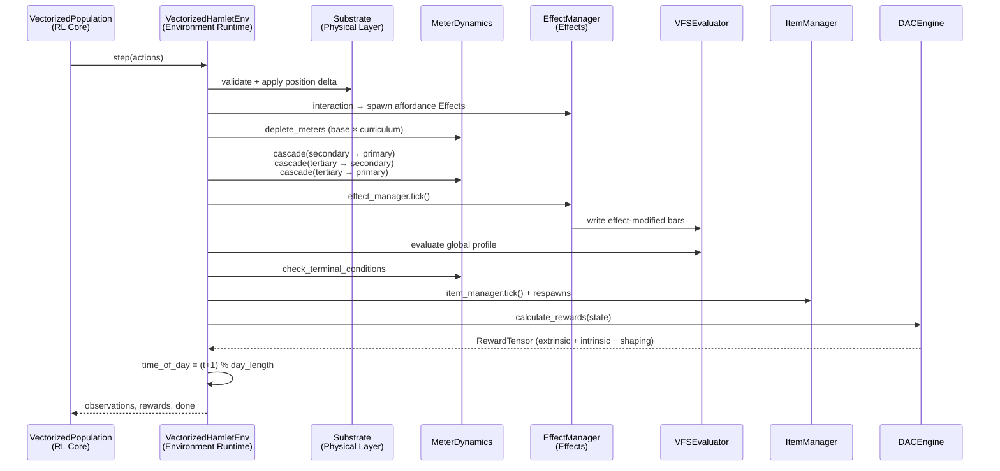
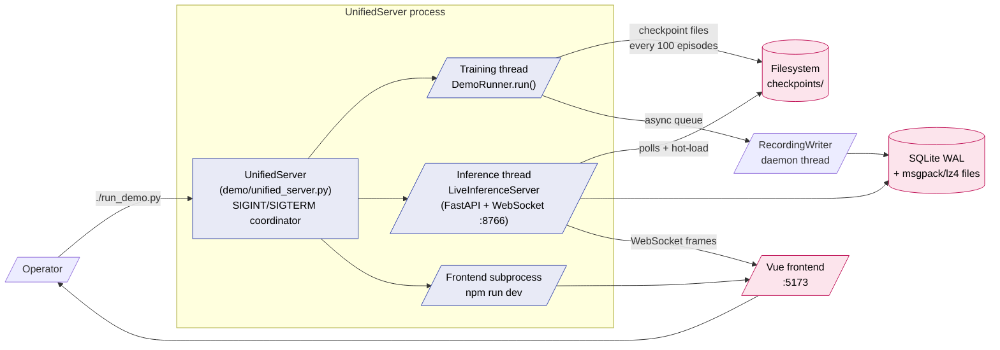
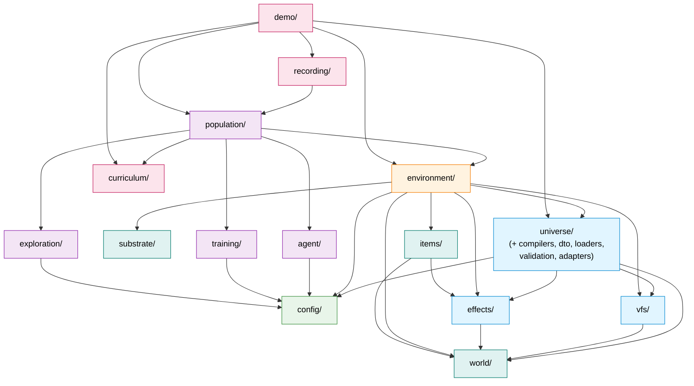

# Architecture Diagrams

Mermaid diagrams at three C4 levels: **System Context**, **Container** (subsystems), and **Component** (universe pipeline detail). All diagrams reflect the post-reorganization state of `src/townlet/` as observed in this analysis.

---

## 1. System Context (C4 Level 1)

The boundary between Townlet and its operator-facing surfaces.

---

## 2. Container Diagram (C4 Level 2 — Subsystems)

The 6 logical subsystems and the data they exchange. Arrows show direction of dependency / data flow at runtime.

---

## 3. Component Diagram — UAC Compilation Pipeline (C4 Level 3)

The seven-stage compiler internal flow with handoff DTOs.

---

## 4. Component Diagram — Runtime Tick (C4 Level 3)

One step of `VectorizedHamletEnv` showing the order of operations and which subsystems participate.

---

## 5. Component Diagram — Demo/Orchestration Topology

How `UnifiedServer` glues training, inference and the frontend together.

---

## 6. Dependency Graph — Subsystem Coupling

Cycle-detection / layering view. Arrows = "depends on at import time" between top-level subsystems.

**Observations on the dependency graph:**

- **No cycles** detected at the top-level. The compilation pipeline (`universe/`, `vfs/`, `effects/`) sits on top of `config/` and `world/`, and is consumed by `environment/`, but does not depend on it.
- **`environment/` is the runtime hub** — six inbound subsystem edges from the RL core / orchestration layer, eight outbound to compile-time and physical-layer subsystems.
- **`world/` is shared by both compile and runtime sides** — the expression evaluator is used by `universe/` at compile time (type-check) and by `effects/` runtime executor for evaluation. This is a deliberate seam, not a leak.
- **`demo/` is the broadest consumer** — depends on `population/`, `environment/`, `universe/`, `recording/`, `curriculum/`. Appropriate for an orchestrator.

---

## Notes

- All diagrams use the post-reorganization state of `src/townlet/` (619-line `compiler.py`, modular `compilers/`, `dto/`, `loaders/`, `validation/`, `adapters/`).
- Mermaid syntax is GitHub-flavoured; renders directly in GitHub-style markdown viewers.
- For a deeper component view of `vectorized_env.py` (2,200 lines, the next decomposition target), see Subsystem 3 in [02-subsystem-catalog.md](02-subsystem-catalog.md), which sketches the proposed split into `action_executor.py`, `observation_encoder.py`, `env_factory.py`, and `reward_calculator.py`.
