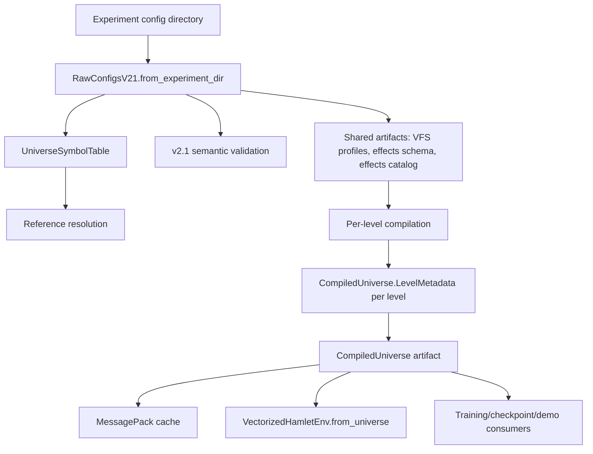

# Compiler Map

## Top-Level Data Flow



## Active Stage Responsibilities

| Stage | Current implementation | Responsibility | Cleanup target |
| --- | --- | --- | --- |
| Stage 0 | `_validate_config_dir`, `_validate_scoping`, `_phase_0_validate_yaml_syntax` | Directory, scoping, YAML syntax | `universe/loaders/preflight.py` |
| Stage 1 | `RawConfigsV21.from_experiment_dir` | Load Pydantic config DTOs | `universe/loaders/v21.py` with no optional/shared ambiguity |
| Stage 2 | `_stage_2_build_symbol_table` | Register named entities | Keep thin, maybe move to `symbol_table.py` |
| Stage 3 | `_stage_3_resolve_references` | Resolve cross-file references | `universe/validation/references.py` |
| Stage 4 | `_validate_v21_semantics` | Semantic contract checks | `universe/validation/semantics.py` split by domain |
| Stage 5 | `_stage_5_prepare_shared_artifacts` | Build VFS/effects schemas and catalogs | `universe/artifacts/shared.py` |
| Stage 6 | `_stage_6_compile_levels` | Build per-level metadata, observation, actions, meters, affordances, optimization | Split into observation/action/metadata/optimization compilers |
| Stage 7 | `_stage_7_emit_artifact` | Construct and cache `CompiledUniverse` | `universe/artifacts/emitter.py` plus strict cache IO |

## Subsystems

### Config Loading

- Current: `RawConfigsV21.from_experiment_dir()` loads shared files, optional root `items.yaml`, per-level `curriculum.yaml`, `bars.yaml`, `affordances.yaml`, `training.yaml`, `drive.yaml`, and optional level `items.yaml`.
- Problem: it mixes loading, aggregation, policy decisions, and invariants in one dataclass constructor path.
- Cleanup: make loader return raw typed DTOs only, then run explicit validation passes.

### Validation

- Current: validation is split across `RawConfigsV21.__post_init__`, `_validate_scoping`, `_validate_v21_semantics`, `_stage_3_resolve_references`, `_validate_dac_references`, and old flat helpers.
- Problem: the same invariants appear in multiple places, and some old validators are only tested as private dead code.
- Cleanup: one validation package with explicit passes: structure, references, semantic invariants, feasibility, limits.

### Observation Compiler

- Current: `_build_observation_spec`, `_build_observation_activity`, `_build_vfs_observation_fields`, and `_build_vfs_variables` sit inside `UniverseCompiler`.
- Problem: observation mode filtering uses description text containing `"MASKED"` to decide activity in some paths, and normalization conversion is duplicated.
- Cleanup: create `ObservationCompiler` that emits `ObservationSpec`, `ObservationActivity`, VFS observation fields, and runtime VFS variable definitions from one typed intermediate.

### Action Compiler

- Current: `_build_action_space_metadata` derives substrate actions, custom actions, system item actions, reserved names, enabled filters, labels, and movement deltas.
- Problem: action filtering and label synthesis are mixed with substrate construction and item action generation.
- Cleanup: create `ActionCompiler` with explicit inputs: substrate action set, custom actions, item actions, enabled policy, label policy.

### Effects Compiler

- Current: `CommandConfig` -> `CommandParser` -> `CommandCompiler` -> `EffectCatalog`.
- Problem: AST nodes support old/new field pairs and parser fallbacks, while the command schema still tolerates aliases and implicit defaults.
- Cleanup: make command schema strict, delete alias fields, use variant-specific command nodes or a discriminated union instead of one dataclass with every possible field.

### Artifact and Cache

- Current: `CompiledUniverse` owns runtime artifact fields plus config DTOs plus serialization and deserialization.
- Problem: deserialization tolerates missing fields with default empty structures even though `COMPILED_SCHEMA_VERSION` exists.
- Cleanup: make cache deserialization strict for current schema. Missing required fields should raise with "cache too old; recompile".

### Runtime Adapter

- Current: `VectorizedHamletEnv` consumes `CompiledUniverse`, but also rebuilds some VFS config DTOs from compiled profiles before building `VFSObservationSpec`.
- Problem: this is an anti-compiler shape; runtime is doing post-compile translation that the compiler should own.
- Cleanup: compiler emits runtime-ready VFS observation artifacts; runtime consumes them directly.

## Modern Compiler Shape

The target architecture should look like:

```text
src/townlet/universe/
  compiler.py                # thin facade/orchestrator only
  pipeline.py                # stage dataclasses and stage runner
  loaders/
    preflight.py
    v21.py
  validation/
    references.py
    semantics.py
    feasibility.py
    limits.py
  compilers/
    observation.py
    actions.py
    effects.py
    metadata.py
    optimization.py
    vfs.py
  artifacts/
    compiled.py              # artifact models only, or keep current compiled.py trimmed
    cache.py
    emitter.py
```

The facade should remain stable:

```python
UniverseCompiler().compile(experiment_dir, primary_level="L0_test", use_cache=True)
```

Everything underneath should become typed, testable compiler passes.

