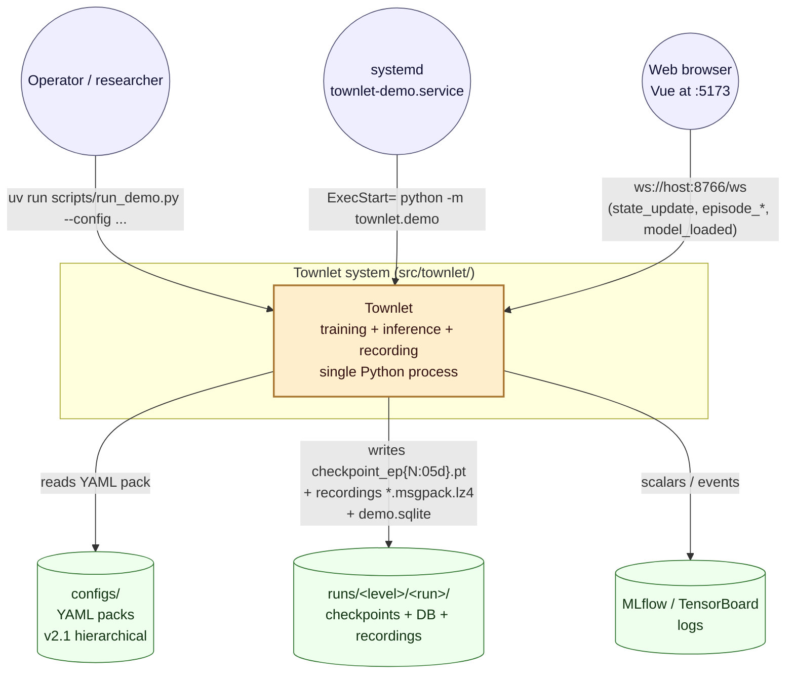
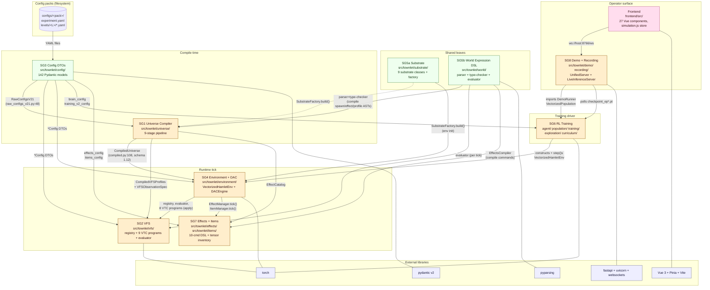
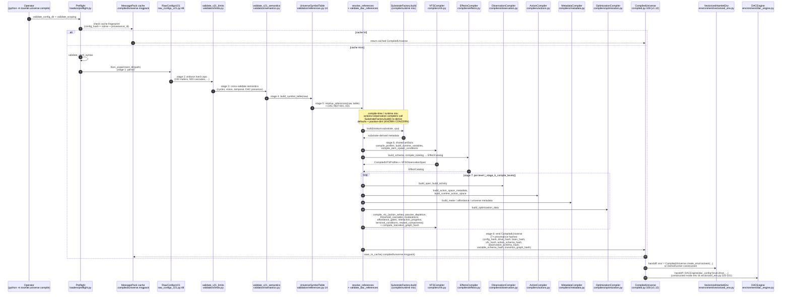

# 03 — Architecture Diagrams

This document contains five diagrams describing Townlet's architecture, drawn directly from
the validated subsystem catalog (`02-subsystem-catalog.md`) and the per-subsystem evidence in
`temp/sg{1..8}-*.md`. Every node maps to a real file, class, or process in
`/home/john/hamlet`; arrows are labelled with the actual call, message, or YAML key that
crosses the boundary.

**A note on C4.** The C4 model is a four-level zoom into a software system. *Level 1
(Context)* shows the system as a single box and the people / external systems that
interact with it. *Level 2 (Container)* opens that box to show the runnable / deployable
pieces inside (here: subsystem packages, configs, frontend). *Level 3 (Component)* opens
one container to show its internal collaborators (here: the per-tick collaboration between
the environment, VFS, effects, and population). C4 has no strict rule for sequence
diagrams; we use two of them (compile-time pipeline and WebSocket broadcast) to capture
the time-ordered behaviours that the static C4 views cannot show.

---

## Diagram 1 — C4 Level 1: System Context

Townlet is a single-process Python application driven by a researcher/operator at the
command line. It reads YAML configuration packs and emits checkpoints and telemetry to
the filesystem; a Vue frontend connects to its embedded FastAPI inference server over
WebSocket to render live training; and the whole stack is intended to run as a systemd
unit (`townlet-demo.service`) on a workstation. There are no other inbound network
surfaces (per catalog §12), which keeps the threat model narrow.



---

## Diagram 2 — C4 Level 2: Container

Zooming inside Townlet, the eight subsystem groups form a layered cluster with a clear
fan-in pattern: **SG3 Config DTOs** and **SG5 World DSL / Substrate** are pure leaf
dependencies — neither imports any sibling subsystem — and everything upstream reads
them. **SG1 Universe Compiler** sits between configuration and runtime, materialising a
single `CompiledUniverse` that **SG4 Environment & DAC** then drives. SG2 (VFS) and SG7
(Effects & Items) are runtime collaborators *inside* the tick; SG6 (RL Training) drives
the env from the outside; SG8 (Demo / Frontend) observes via filesystem and WebSocket.
The arrows below are derived from the §9 dependency matrix in the catalog.



**Validation hook (catalog §9).** The diagram shows SG5 World DSL as a **leaf** consumed
by SG1, SG2, and SG7 — exactly as the matrix demands. SG5 Substrate is similarly a leaf,
but with an awkward extra arrow into SG1 (compile-time invocation of
`SubstrateFactory.build`), which the compile-pipeline diagram below makes explicit as a
known concern.

---

## Diagram 3 — C4 Level 3: Runtime tick (SG4 ↔ SG2 ↔ SG7 ↔ SG6)

This component view zooms into the 16 stages of `VectorizedHamletEnv.step()` documented
in catalog §4 (per `vectorized_env.py:1084-1218`). The key insight is that the tick is
not "env → step → reward"; it is a strict pipeline of action execution, phase-graph-driven
VTC transition execution, an effects pass, a VFS evaluator pass, terminal checks, item
lifecycle, and only *then* reward. The environment's four `_apply_vtc_*` methods are now
thin wrappers over `_run_vtc_transition_phases`, which delegates to `VTCTransitionRunner`
instead of hard-coding each rule family at the call site. The reward itself is routed through
`VTCRewardProgram` with a `reward_backend=DACEngine` parameter, not through a direct DAC
call. Each numbered edge is one stage of the tick.

```mermaid
flowchart TB
    classDef pop  fill:#fde,stroke:#a37,stroke-width:1.5px,color:#311
    classDef env  fill:#fec,stroke:#a73,stroke-width:1.5px,color:#311
    classDef vfs  fill:#dfe,stroke:#373,stroke-width:1.5px,color:#131
    classDef fx   fill:#def,stroke:#357,stroke-width:1.5px,color:#113
    classDef dac  fill:#fed,stroke:#a55,stroke-width:1.5px,color:#311

    subgraph SG6["SG6 Population (driver)"]
        Pop[VectorizedPopulation<br/>population/vectorized.py:step_population]:::pop
        Expl[Exploration module<br/>exploration/rnd.py | adaptive_intrinsic.py]:::pop
    end

    subgraph SG4["SG4 Environment (VectorizedHamletEnv.step, 1084-1218)"]
        ActExec[ActionExecutor<br/>action_executor.py:20-158]:::env
        AffEng[AffordanceEngine<br/>affordance_engine.py:46-573]:::env
        RewCalc[RewardCalculator<br/>reward_calculator.py:19-53]:::env
        DAC[DACEngine<br/>dac_engine.py:28-1012<br/>extrinsic + intrinsic + shaping]:::dac
        ObsEnc[ObservationEncoder<br/>vectorized_env.py:assemble obs]:::env
        Meters[(self.meters tensor<br/>self.positions tensor<br/>self.dones tensor)]
    end

    subgraph SG2["SG2 VFS (compiled VTC programs)"]
        Reg[VariableRegistry<br/>vfs/registry.py:9 scopes]:::vfs
        Runner[VTCTransitionRunner<br/>vfs/transition_schedule.py<br/>phase-graph executor]:::vfs
        ActW[VTCActionWriteProgram]:::vfs
        PassDep[VTCPassiveDepletionProgram]:::vfs
        ThrCas[VTCThresholdCascadeProgram]:::vfs
        Eval[VFSEvaluator<br/>vfs/evaluator.py]:::vfs
        Term[VTCTerminalConditionProgram]:::vfs
        IntProg[VTCInteractionProgressProgram<br/>(per-agent loop)]:::vfs
        Mod[VTCModulationProgram]:::vfs
        AffGate[VTCAffordanceGateProgram]:::vfs
        Rew[VTCRewardProgram<br/>reward_backend=DACEngine]:::vfs
    end

    subgraph SG7["SG7 Effects + Items"]
        EM[EffectManager.tick<br/>effects/manager.py:59]:::fx
        Sched[Scheduler<br/>effects/scheduler.py:21<br/>DELAY queue]:::fx
        IM[ItemManager.tick<br/>+ process_respawns]:::fx
    end

    %% --- driver
    Pop  -- "0. actions, depletion_multiplier<br/>(decisions[0].depletion_multiplier)" --> ActExec
    Expl -- "intrinsic_raw (RND novelty)" --> RewCalc

    %% --- tick stages 1..16
    ActExec      -- "1. apply movement / INTERACT / item verbs<br/>(action_executor.py:23-156)" --> Meters
    ActExec      -- "1f. dispatch affordances" --> AffEng
    AffEng       -- "1f. _execute_affordance_effects" --> EM
    AffEng       -- "1f. _advance_vtc_interaction_progress" --> IntProg
    ActExec      -- "2. _apply_vtc_action_writes<br/>thin wrapper" --> Runner
    Runner       -- "phase graph through<br/>apply_completion_bonuses" --> ActW
    ActW         -- "writes vars" --> Reg
    Meters       -- "3. _apply_vtc_passive_depletion<br/>thin wrapper" --> Runner
    Runner       -- "apply_passive_depletion" --> PassDep
    PassDep      -- "deplete meters" --> Meters
    Meters       -- "4. _apply_vtc_threshold_cascades<br/>thin wrapper" --> Runner
    Runner       -- "apply_threshold_cascades" --> ThrCas
    ThrCas       -- "cascade writes" --> Meters
    EM           -- "5. effect_manager.tick(bars, vfs, global_tick, items)<br/>(line 1114-1130)" --> Meters
    EM           -- "5. queue / fire delayed effects" --> Sched
    EM           -- "5. spawn/despawn items" --> IM
    Reg          -- "6. evaluator pass<br/>(line 1132-1166)" --> Eval
    Eval         -- "6. set_engine_value(...)" --> Reg
    Meters       -- "7. _apply_vtc_terminal_conditions<br/>thin wrapper" --> Runner
    Runner       -- "evaluate_terminal_conditions" --> Term
    Term         -- "7. self.dones |= ..." --> Meters
    Meters       -- "8. step_counts += 1<br/>global_tick += 1" --> Meters
    IM           -- "9. item.tick + respawns<br/>(line 1177-1184)" --> Meters
    Meters       -- "10. retirement check<br/>(line 1188)" --> Meters

    %% Reward routing — validation hook
    RewCalc      -- "11. env.vtc_reward_program.apply(<br/>&nbsp;&nbsp;reward_backend=env.dac_engine,<br/>&nbsp;&nbsp;intrinsic_raw, ...)<br/>(reward_calculator.py:41-48)" --> Rew
    Rew          -- "11. delegate to backend" --> DAC
    DAC          -- "11. rewards, components" --> RewCalc

    Meters       -- "12. temporal increment" --> Meters
    Reg          -- "13. assemble observation<br/>flatten registry tensors" --> ObsEnc
    ObsEnc       -- "14. obs, rewards, dones, info" --> Pop

    %% --- ambient (not numbered): modulation & gate programs read by AffEng
    AffEng       -. "compute_affordance_multiplier" .-> Mod
    AffEng       -. "gate eligibility" .-> AffGate
```

**Validation hook (catalog §4).** Reward routing goes
`RewardCalculator → VTCRewardProgram.apply(reward_backend=DACEngine, ...) → DACEngine`,
not directly from env to DACEngine. The indirection is undocumented inside
`dac_engine.py` itself (per SG4 evidence at `reward_calculator.py:41-48` and
`vectorized_env.py:1191`); the diagram makes it explicit.

**Transition hook.** The action-write, passive-depletion, threshold-cascade, and terminal-condition
edges above enter SG2 through `VTCTransitionRunner`. Those four `_apply_vtc_*` environment methods
remain useful step-stage labels, but they are phase-graph-driven wrappers over the generic runner.

---

## Diagram 4 — Sequence: compile-time pipeline (9 stages → CompiledUniverse)

This sequence shows the compile path from raw YAML on disk to the cached
`CompiledUniverse` artifact that every runtime subsystem then reads. The pipeline has
**nine conceptual stages** (catalog §1 / SG1 evidence) with three different internal
numbering schemes — `_log_stage` 1-8, inline comments 0-7, and exception `stage=`
labels — so the diagram uses the conceptual ordering from the SG1 table. Four validation
passes (limits, semantics, references, DAC-refs) gate progression; seven provenance
hashes (`config_hash`, `drive_hash`, `brain_hash`, `vfs_hash`, `action_schema_hash`,
`observation_schema_hash`, `variable_schema_hash`, `transition_graph_hash`) fall out of
the emit stage and flow to checkpoint validation in SG6.



**Validation hooks (catalog §11.5 + §1).** Two things are explicit in the diagram:

1. **`SubstrateFactory.build()` is called from inside the compile path** (from
   `compilers/actions.py:70` and `compilers/observation.py:148-155`) — a known
   compile-time / runtime layering violation flagged by both SG1 and SG5.
2. **Seven (in practice: eight) provenance hashes flow out of `CompiledUniverse`**,
   feeding both the cache fingerprint and the SG6 checkpoint validator at
   `training/checkpoint_utils.py:98-107`. Any mismatch on load raises.

---

## Diagram 5 — Sequence: WebSocket inference broadcast (5 Hz)

The demo bridges its two threads — training and inference — through the filesystem, not
shared memory. `DemoRunner` writes `checkpoint_ep{N:05d}.pt` into
`runs/<level>/<run>/checkpoints/`; `LiveInferenceServer` polls that directory in its
inference loop, hot-loads new checkpoints, runs episodes at human-watchable speed, and
broadcasts state frames to all connected WebSocket clients at ~5 Hz (default
`step_delay = 0.2 / speed`). The Vue store on the browser side auto-reconnects up to ten
times at 3 s intervals and auto-plays on connect. This is the only inbound network
surface the system exposes.

```mermaid
sequenceDiagram
    autonumber
    participant US as UnifiedServer<br/>(training thread)<br/>demo/unified_server.py
    participant Run as DemoRunner.run<br/>demo/runner.py
    participant FS as runs/&lt;level&gt;/&lt;run&gt;/<br/>checkpoints/checkpoint_ep{N:05d}.pt
    participant Inf as LiveInferenceServer<br/>(uvicorn thread)<br/>demo/live_inference.py
    participant Wkr as LiveInferenceWorker<br/>inference loop in Inf
    participant Vue as frontend/src/stores/simulation.js<br/>(Vue 3 + Pinia + Vite)
    participant User as Browser tab (Vue UI)

    Note over US,Inf: One process, two threads.<br/>Bridge = filesystem (no shared memory).

    User->>Vue: page load (localhost:5173)
    Vue->>Inf: connect ws://host:8766/ws<br/>(simulation.js:158-164;<br/>max 10 retries × 3000 ms)
    Inf-->>Vue: frame "connected"<br/>{available_models, action_labels,<br/>checkpoint_episode, total_episodes,<br/>substrate, ...}<br/>(live_inference.py:520)
    Vue->>Vue: auto-play after 100ms<br/>(simulation.js:184)

    par training thread
        US->>Run: start training loop
        loop episodes
            Run->>Run: train one episode
            Run->>FS: torch.save(checkpoint_ep{N:05d}.pt)
        end
    and inference thread
        loop poll
            Wkr->>FS: _check_and_load_checkpoint<br/>(live_inference.py:419)
            alt new checkpoint found
                FS-->>Wkr: state_dict + metadata
                Wkr->>Wkr: hot-reload Q-network<br/>verify drive_hash + vfs_hash
                Wkr-->>Vue: broadcast "model_loaded"<br/>{model, episode, total_episodes, epsilon}
            end

            Wkr->>Wkr: step inference env once<br/>compute q_values, action_masks,<br/>heat_map, rnd_metrics
            Wkr-->>Vue: broadcast "state_update"<br/>{step, cumulative_reward, grid,<br/>agent_meters, q_values,<br/>action_masks, heat_map,<br/>affordance_stats, temporal, ...}<br/>(at ~5 Hz; step_delay = 0.2 / speed)
            Wkr->>Wkr: sleep(step_delay)
        end
    end

    Vue->>Inf: client→server "set_speed" {value}<br/>(simulation.js)
    Note over Inf,Wkr: step_delay = 0.2 / speed

    Note over Wkr,Vue: Episode boundary frames:<br/>"episode_start", "episode_end",<br/>"episode_complete", "training_complete"

    alt connection drops
        Vue->>Vue: onclose → schedule reconnect<br/>(simulation.js:6-23, attempt × 3000 ms)
        Vue->>Inf: reconnect ws://host:8766/ws
        Inf-->>Vue: "connected" replay
    end
```

**Validation hooks (catalog §8).** The diagram surfaces the architectural fact that
*there is no in-memory queue between trainer and inference*: every state transition
between threads is mediated by the on-disk checkpoint files at
`runs/<level>/<run>/checkpoints/checkpoint_ep*.pt`. The broadcast cadence is the inference
loop's own `step_delay`, not a separate scheduler. Auto-reconnect is bounded
(10 attempts × 3 s); after that the UI gives up and the user must refresh.

---

## How to use these diagrams

- **First-time onboarding.** Read Diagrams 1, 2, then 3 in order. Diagram 1 establishes
  the boundary; Diagram 2 names every subsystem you will encounter in the codebase;
  Diagram 3 shows how the eight subsystems collaborate per tick. After that, the
  catalog's §1-§8 per-subsystem entries make sense.

- **Tracing a bug into the runtime.** Diagram 3 is the map. Find which stage of the tick
  the bug is in (action exec, VTC writes, depletion, cascades, effects, VFS, terminal,
  items, reward, observation), then go to the cited `vectorized_env.py:<line>` and
  follow into SG2 / SG7 from there.

- **Reasoning about a config change.** Diagram 4 is the map. Locate the YAML field's
  Pydantic DTO in SG3, follow the arrow into SG1's pipeline, and check which stage
  validates it. If you are changing the *runtime* surface of a config field (e.g.
  reward shaping), you also need to consult Diagram 3 — the field is materialised by
  `DACEngine._compile_*` at construction time and frozen for the lifetime of the run.

- **Investigating inference / frontend issues.** Diagram 5 is the map. The most common
  failure mode is *no checkpoint visible to the inference thread*: check
  `runs/<level>/<run>/checkpoints/` for the file, then check `live_inference.py:419`
  log output. Frontend-side failures usually surface as a stuck "reconnecting…" badge
  in `simulation.js:6-23`.

- **What is *not* in these diagrams.** Recording (`src/townlet/recording/`) is an
  off-tick producer/consumer queue that does not interact with the tick itself; video
  rendering is a separate `python -m townlet.recording` pipeline. MLflow / TensorBoard
  logging happens from inside `DemoRunner.run` but is fire-and-forget. None of these
  paths affect the runtime correctness of training, so they are intentionally elided.

- **Pairing with the catalog.** Every node on every diagram is sourced from a section
  of `02-subsystem-catalog.md`. When in doubt, the catalog text is authoritative; the
  diagrams are a navigation surface, not a substitute.
